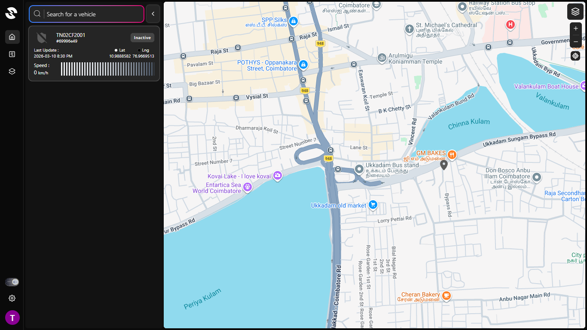

# Vehicle GPS Tracking System

A real-time vehicle GPS tracking system that allows users to monitor vehicle
location, view travel history, and analyze distance travelled through
interactive dashboards.

## Live Demo

https://d1qd1o0gf74e2z.cloudfront.net

## Features

- Real-time GPS tracking
- Vehicle travel history
- Distance travelled reports
- Live vehicle location map
- Multi-device login support

## Tech Stack

Frontend

- React
- Redux
- Tailwind CSS

Backend

- Node.js
- Express

Database

- MongoDB

Deployment

- AWS EC2
- AWS S3
- CloudFront

## How it Works

1. User logs in from mobile device
2. GPS coordinates are collected from the device
3. Backend API stores location data in MongoDB
4. Data is processed to calculate travel distance
5. Dashboard displays vehicle route and reports

## Installation

Clone the repository

git clone https://github.com/username/project-name

Install dependencies

npm install

Start server

npm run dev

## Screenshots

## API Endpoints

POST /api/auth/login
POST /api/auth/register
POST /api/auth/resetPassword
POST /api/auth/forgotPasswordOtp

## Future Improvements

- AI based vehicle anomaly detection
- Route optimization
- Mobile application

## Author

Praveen K
LinkedIn: [link](https://www.linkedin.com/in/praveen-k-devcreate)
